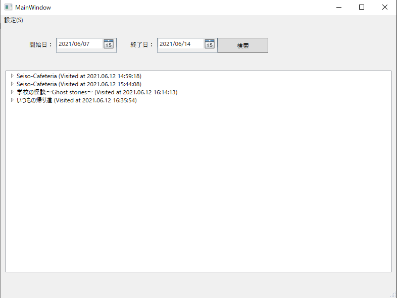
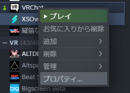

# VRCLogAnalyzer
VRChatのログを解析して、訪れたワールドやその場にいたユーザーのデータベースを作成するWFPアプリです。

現在、ベータ版で動作確認してくれる方を募っています。

## 動作環境

- OS: Windows 10 （64bit）
- SteamからVRChatを起動（Oculusからの起動は未確認）
- VRChatの起動オプションに「--enable-sdk-log-levels」を追加（確認中）
  - ユーザー情報とワールドの詳細をログ出力させるためのオプション追加
  - すでにほかのオプションを指定している場合は、半角スペースで区切って追加する。
  - なくても動くとの情報もあるので、現在、条件確認中です。ユーザーのプロフィールやワールドの説明書きなどは、このオプションがないと取得できないかもしれません。（ただ、特にユーザープロフィールはオプションがあっても必ずログに出るとは限らないため、未確定）

対応環境は、今後拡大する可能性はありますが、複数環境への対応大変なので、自分も使っている一般的なVRChat環境に限定して動作確認しています。

## 動作説明

- VRChatのデフォルトのログパスからログファイルを取得し、データベースに格納します。
- データベースファイルは、現在MyDocument直下に置かれています（ベータ完了後、長期的な保存に適したフォルダに以降予定）
- データベースはSQLite3を利用しており、SQLite3のクライアントから直接確認することも可能です。

## 操作方法

### データベースの更新

- アプリ起動後、「設定」メニューから「データの更新」を選択すると、ログからデータベースにデータが取り込まれます。
- データベースの更新は、コマンドラインから「VRCLogAnalyzer.exe /analyze」とオプションをつけて実行することもできます。VRChatのログは、数日でローテーションして消えてしまうので、これをタスクスケジューラ等から1日1回実行するような使い方を想定しています。

### データの表示

- 現在、ユーザーとの交流ログの表示機能だけがあります。日付で絞り込んで検索することができます。（誰とも会っていないワールドは表示対象に含まれません）
- ワールドだけの履歴も保存してるので、ワールド履歴だけの機能を今後追加予定です。
- ユーザー名等、別の情報での検索も必要に応じて追加予定です。

## アプリのコンセプト

### コンセプト

- みんなが使える、安心設計のVRChat履歴アプリ
  - ローカルPCに閉じたログ解析で、VRChatに追加の負担をかけずに誰もが使える
  - シンプルで、どのような処理をしているのか明確
  - プライバシーを尊重し、ユーザーデータは必要最低限だけ

### このアプリではやらないこと

- ログ以外（VRChat APIやVRChatウェブサイトを含む）からの情報収集
  - VRChat APIは、非公式となっており、また、多くの人がAPIにアクセスすることでVRChatのサーバー側負荷が高くなってしまうおそれがあるため、ローカルPCだけで話が完結するログのみをデータソースとして利用する
  - 結果として、VRChatのIDとパスワードが必要になるようなリソースも利用しない
  - ユーザープロフィールなど、詳細情報が取れない場合もありますが、それはこのアプリのコンセプト上やむを得ないと考えています。（取れたらラッキーぐらいで考えておいてください）
- 現在表示している以上のユーザー情報の収集
  - プライバシーを考慮し、このアプリでは収集する情報はVRChat上で会ってプロフィールを確認すればわかる範囲に収集対象を限定し、表示に利用している以上のユーザー情報を収集しない
  - 何回会っているなど、フレンド管理のような機能も提供しない
- 訪問履歴以外のワールド情報の提供
  - ワールドの情報は、訪問履歴の記録のためだけに利用する。（不具合対応や今後の機能拡張に備えてワールドのID等は記録はしているが、アプリ側で直接表示する機能は設けない）

